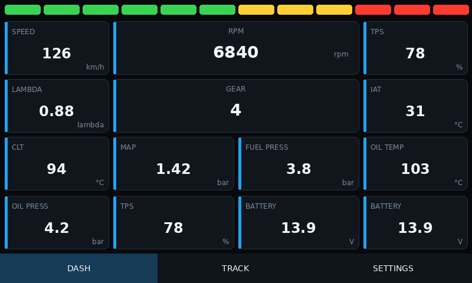
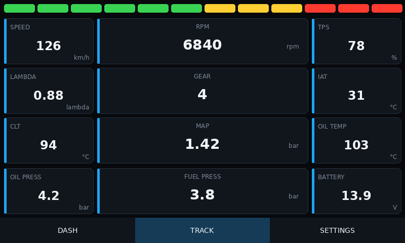
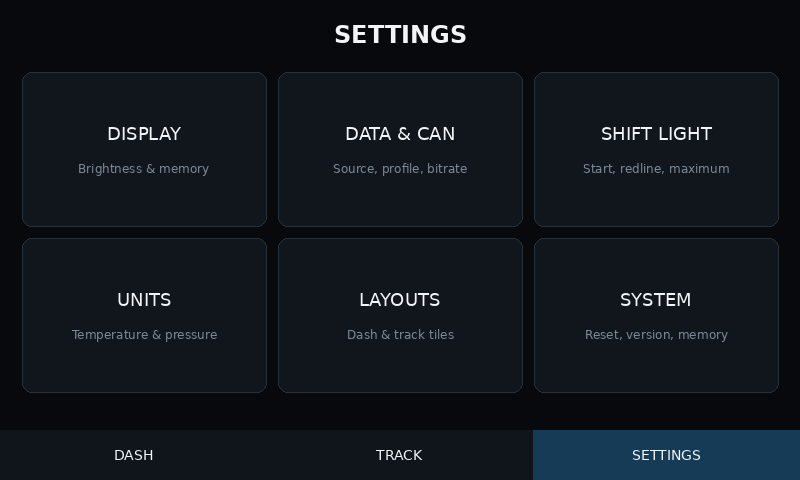
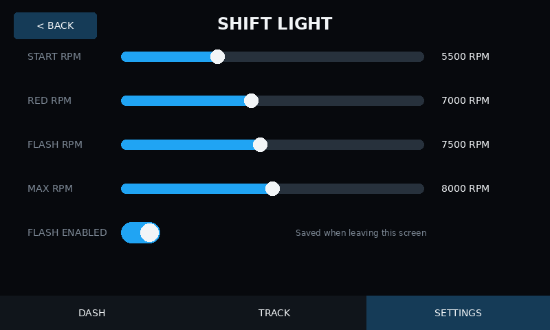

# DIY Dash 5

Modular motorsport dashboard firmware for the
**Waveshare ESP32-S3-Touch-LCD-5** non-B board. The project drives the real
800x480 LCD and GT911 touch controller, initializes OPI PSRAM and ESP32 TWAI,
and renders telemetry through LVGL 8.4.

The current test-board firmware provides configurable DASH and TRACK layouts,
persistent tile warnings, fixed non-scrolling SETTINGS pages, and a shared
four-threshold shift-light strip. Its table-driven CAN decoder includes six
source-pinned ECU profiles, including stock BMW MS43, plus separately labelled
experimental Link and Citroën C2 profiles. A clearly labelled DEMO source
supports display and UI bring-up without a connected ECU.

## UI preview

| DASH | TRACK |
| --- | --- |
|  |  |

| SETTINGS | SHIFT LIGHT |
| --- | --- |
|  |  |

| FLAG TILES | FLAG EDITOR |
| --- | --- |
|  |  |

All thirteen CI-rendered 800x480 screens are stored in
[`docs/ui/screenshots`](docs/ui/screenshots). They are deterministic previews;
the physical-board checklist remains required.

## Hardware

- Waveshare ESP32-S3-Touch-LCD-5, non-B variant
- ESP32-S3 dual-core MCU
- 5-inch 800x480 RGB LCD
- GT911 capacitive touch controller
- 16 MB flash
- 8 MB OPI PSRAM
- onboard TJA1051 CAN transceiver

CAN/TWAI pinout:

| Function | ESP32-S3 pin |
| --- | ---: |
| CAN TX | GPIO15 |
| CAN RX | GPIO16 |

Connect CANH and CANL to a correctly terminated CAN bus. Bitrate and explicit
CAN/DEMO selection are saved from SETTINGS. CAN runs receive-only and never
falls back automatically to generated DEMO data.

## Software stack

- PlatformIO 6.1.18
- pioarduino ESP32 platform 53.3.11 / Arduino-ESP32 3.1.1
- ESP32_Display_Panel 1.0.4
- ESP32_IO_Expander 1.1.1
- esp-lib-utils 0.2.0
- LVGL 8.4.0
- C++17

Versions are pinned in `platformio.ini` so local and CI builds use the same
interfaces.

## Local build

Install Python 3.12 and PlatformIO, then run from the repository root:

```bash
python -m pip install platformio==6.1.18
pio test -e native
pio run -e waveshare_5
```

The target output is written to `.pio/build/waveshare_5/`.

## Flashing

The easiest first flash uses the merged image at offset `0x0`:

```bash
python -m esptool --chip esp32s3 --port COM5 erase_flash
python -m esptool --chip esp32s3 --port COM5 --baud 921600 write_flash \
  0x0 .pio/build/waveshare_5/DIY-Dash-ESP32-S3-Touch-LCD-5-full.bin
```

Replace `COM5` with the detected device port. PlatformIO can also build and
upload directly:

```bash
pio run -e waveshare_5 -t upload --upload-port COM5
```

When flashing component binaries separately, use the offsets recorded by the
same build in `.pio/build/waveshare_5/flash-layout.json`. Do not copy offsets
from another platform or release.

## GitHub Actions artifacts

The workflow `.github/workflows/build-firmware.yml` runs for pushes, pull
requests, and manual dispatches. It executes native unit tests, compiles the
Waveshare target, merges the full-flash image from PlatformIO's actual build
metadata, and uploads the artifact `DIY-Dash-firmware`.

The artifact contains:

- `firmware.bin`
- `bootloader.bin`
- `partitions.bin`
- `boot_app0.bin` when generated by the selected framework
- `DIY-Dash-ESP32-S3-Touch-LCD-5-full.bin`
- `flash-layout.json`
- thirteen 800x480 UI preview PNG files

`flash-layout.json` records every address/file pair supplied to esptool for that
specific build.

## Runtime architecture

```text
TWAI/CAN
   -> CanDriver
      -> EcuCanDecoder
         -> VehicleState
            -> AlarmManager
            -> UI

DemoTelemetry ----------------> VehicleState
```

Hardware access is isolated in `src/board` and `src/can`. Decoder, telemetry
selection, data validity, and alarms contain no Arduino or LVGL dependencies and
are covered by host-native tests. `App` owns orchestration and updates LVGL at a
bounded rate.

## VehicleState

`VehicleState` is the only telemetry model consumed by the UI. Its 101 stable
selectable parameters comprise 35 numeric values and 66 boolean states. Numeric
channels cover the original engine data plus barometric/boost/coolant
pressure, fuel temperature, ethanol, second lambda, ignition, injector duty and
pulse width, accelerator position, mass airflow, EGT 1-8, and four individual
wheel speeds. Boolean channels cover only states explicitly documented by each
profile source. Every slot has a value, update timestamp, and validity flag;
the complete snapshot also declares whether it came from CAN, DEMO, or no
source.

Resetting the source clears every signal. This prevents stale CAN measurements
from appearing alongside generated DEMO data. Invalid values are rendered as
`---`.

## CAN decoder framework

`EcuCanDecoder` is table-driven. Each compiled `CanSignalDefinition` declares:

- CAN ID and standard/extended format
- byte offset
- little- or big-endian order
- signed/unsigned 8-, 16-, or 32-bit raw type
- scale and additive offset
- destination `VehicleSignal`
- signal timeout

The decoder validates standard/extended format, remote-frame status, exact DLC,
optional frame discriminators, and every signal range before atomically applying
a frame. SETTINGS exposes `none`, ECUMaster EMU Black, rusEFI verbose, MaxxECU
Default 1.3, Haltech Broadcast 2.0, Speeduino Haltech mode, BMW MS43 Stock, and
the experimental Link Generic Dash and PSA C2 VTS engine profiles. The MS43
profile consumes only documented stock `0x316`, `0x329`, and `0x545` frames at
500 kbit/s; there is no OLM profile, K-line dependency, or custom `0x33C`
stream. Exact source revisions and mapped scope are in
[`docs/can/profile-sources.md`](docs/can/profile-sources.md).

## CAN and DEMO status

The low-level driver initializes ESP32 TWAI on GPIO15/GPIO16 and receives without
blocking the UI loop. The dashboard distinguishes `WAITING`, `ONLINE`, `OFFLINE`,
and `INIT FAILED`.

Only a frame accepted by the active decoder marks telemetry online. In CAN mode,
a timeout leaves values invalid and never activates DEMO. DEMO runs only when it
is explicitly selected and saved in SETTINGS.

## Dashboard and alarms

The navigation is exactly DASH, TRACK, and SETTINGS. DASH contains four small
tiles on each side, two centered wide tiles, and four center-small tiles. TRACK
contains four small tiles on each side and four centered wide tiles. Both pages
share the same configurable shift-light strip. Holding a tile for about 600 ms
opens an independent full-screen editor; the dashboard and shift strip stop
rendering behind it. In DEMO the parameter list contains every channel; in CAN
it contains only channels decoded by the active profile. An existing unsupported
assignment is preserved and shown as `---` / `UNAVAILABLE` until replaced.
Numeric tiles provide visibility, decimals, and a fully configurable warning.
Temperature tiles can also show a continuous color bar with independently
configurable MIN, READY, RED, and MAX values. MIN/MAX define fill, READY begins
the normal range, and RED selects the over-temperature color threshold. Coolant
and oil temperature bars are enabled by default; IAT, fuel-temperature, and EGT
bars remain optional.
Flag tiles show a neutral grey `OFF` pill or a colored rail, tinted background,
and `ON` pill. Yellow, green, or red active color is saved independently for
each tile; stale flags show `UNAVAILABLE` and never retain an active tint.
Temperature editors use an explicit signed `+000.0` / `-000.0` display;
non-negative warning values use `000.0`. Warning thresholds and hysteresis use
a 0.0-999.0 range in 0.1 steps. SETTINGS changes are applied in RAM while controls are
used and written once when the user leaves the screen. Flash writes run outside
LVGL callbacks to avoid interrupting active RGB-panel rendering.
See `docs/ui/dashboard-config-guide.md` for controls and safety limitations.

The DASH and TRACK shift-light strips share four ordered thresholds:
`START < RED < FLASH <= MAX`. Above the independent FLASH threshold, an enabled
flash option alternates the complete strip between red and off at approximately
4 Hz. All sliders span 0-10000 RPM in 100 RPM steps. Normal progression always
uses four green, four yellow, and four red segments; thresholds control when the
fixed color zones illuminate.

Visible DASH and TRACK telemetry uses a stable 40 Hz render cadence matched to
the RGB panel. Fast tiles update at 40 Hz, medium tiles at 20 Hz, and slow tiles
at 10 Hz with elapsed-time interpolation between raw samples. DEMO engine speed
uses a smooth ten-second cycle with a four-second rise, two seconds held at
7800 RPM, and a four-second fall. Warning decisions and the shift strip use raw
telemetry; the strip is evaluated independently at 200 Hz and flashes at 4 Hz.

## Serial diagnostics

USB Serial uses 115200 baud. Startup logs include detected flash and PSRAM sizes,
LCD dimensions, GT911 availability, TWAI pins and bitrate, mapping count, DEMO
configuration, and fatal/degraded initialization states.

## Physical acceptance test

A successful CI build proves compilation and artifact generation, not electrical
or timing behavior. After flashing the target board, verify:

1. boot completes without a reset loop;
2. LCD renders the DASH screen at 800x480;
3. touch switches DASH, TRACK, and SETTINGS, opens each tile editor, and moves
   all four SHIFT LIGHT sliders;
4. DEMO values update smoothly only when DEMO is selected;
5. repeated brightness and shift-slider movement remains artifact-free, and
   settings save once when leaving the category and survive a reboot;
6. enabling shift flash makes the complete DASH and TRACK strip blink red at
   the configured FLASH RPM, while disabling it preserves normal progression;
7. CAN changes from waiting/offline only after a mapped frame is introduced;
8. CAN disconnect never leaves real values presented as current or activates DEMO;
9. the display remains responsive for at least 15 minutes.

## Next milestone

Capture and compare real traffic from each target ECU, especially the 2005
Citroën C2 VTS and Link Generic Dash streams, then promote only hardware-verified
experimental mappings. Unknown frames remain unsupported rather than guessed.
