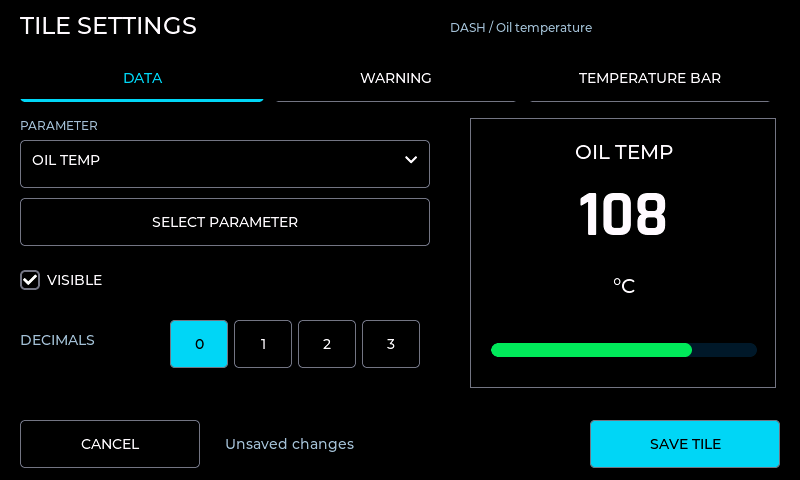
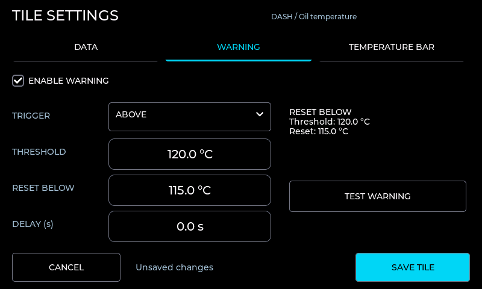
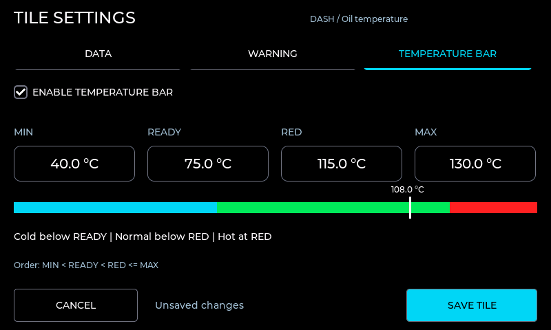
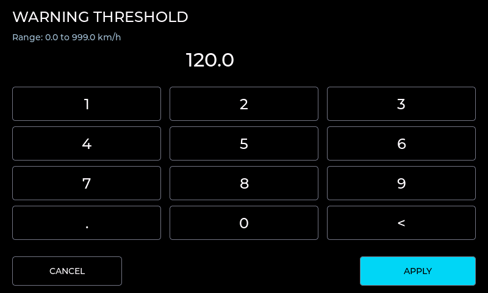
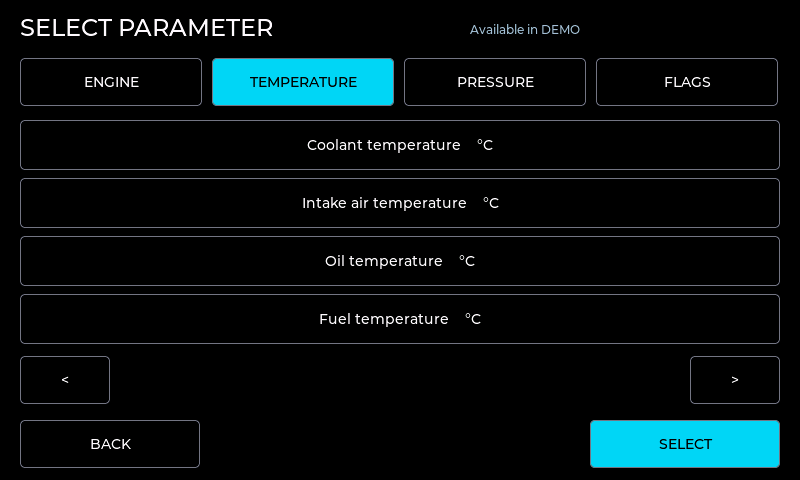
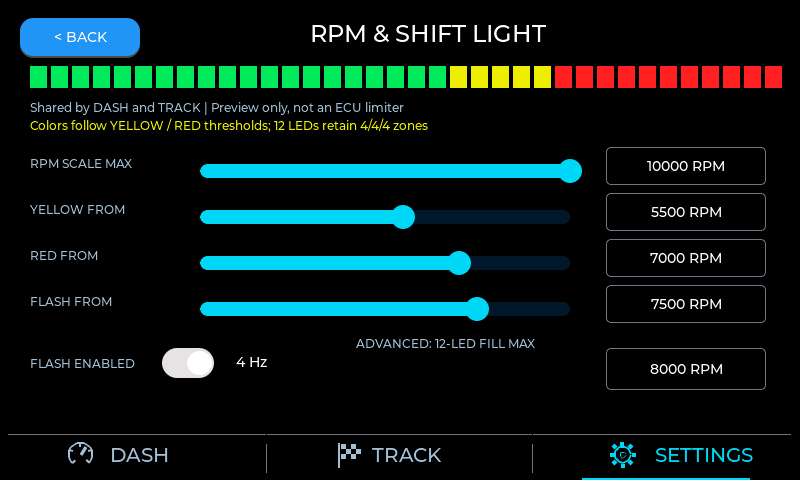
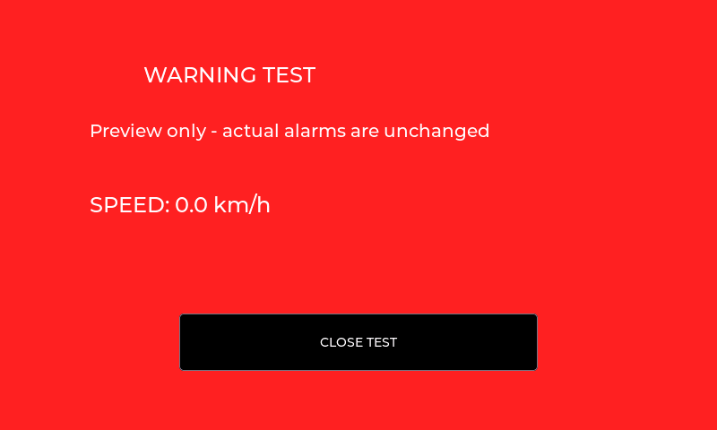
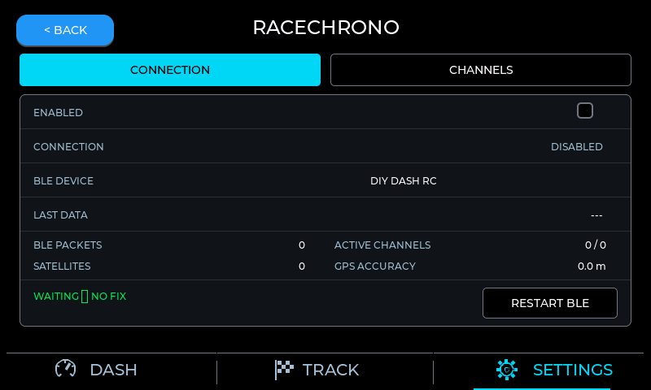
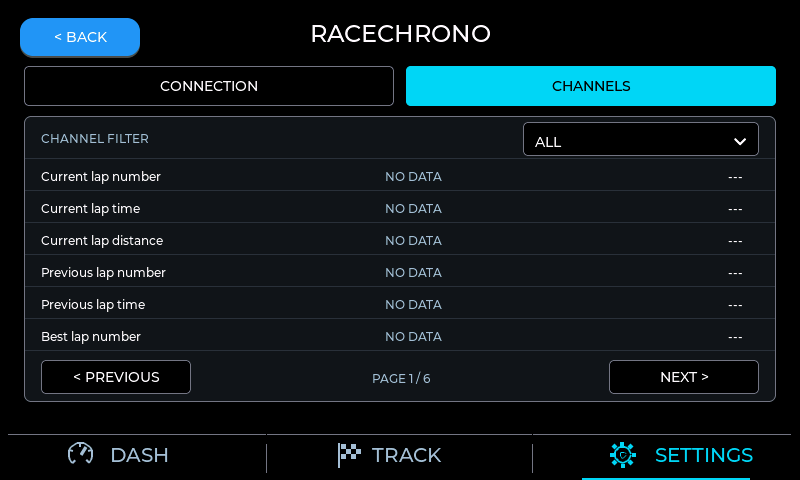
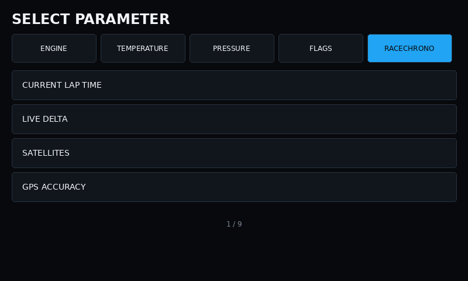

# Dashboard configuration guide

This firmware targets the Waveshare ESP32-S3-Touch-LCD-5 non-B at 800x480.
The bottom navigation contains DASH, TRACK, and SETTINGS; DIAG is not present.

## Tiles and layout

The development firmware offers six presets: Classic DASH (14 slots),
Classic TRACK (12), Analog Style (7), Side Gear (8), Strip Style (8), and
Modern Motorsport (6). Both selectors in `SETTINGS > LAYOUTS` offer all six. DASH and TRACK
can use the same preset and retain separate configuration banks when switching.
Use DASH TILES / TRACK TILES to edit the selected page's visible and hidden slots.

`RPM SCALE MAX` is shared across both pages, starts at 100 RPM, ends at 10,000,
and uses 100-RPM steps. The scale always starts at zero. Shift-light thresholds
remain independent. Analog dials and strips always show RPM, while numeric tiles
remain assignable to any available parameter. These features are not in the
published v0.2.1 release. Settings save when leaving the category.

The approved development appearance uses black panels, thin neutral-grey outlines,
condensed Rajdhani digits, grey rails, and cyan navigation. Side
Gear shares one RPM/speed frame; Strip Style has no center-card outlines or logo.
Analog uses a colored segmented dial ring. Its configured shift flash alternates
the entire ring red/dim; the moving rectangular index stays white. Its center
tile is independently configurable while the ring always shows RPM.
Side/Strip flash their entire segmented RPM bar; the Classic presets keep the
12-segment 4+4+4 shift strip. All use the existing 4-Hz configured flash behavior.
Production-view PNGs are captured by the standalone LVGL harness documented in
`design/production-preview/README.md`, separately from older Pillow previews.

Hold a visible tile for about 600 ms to open its independent full-screen editor;
a short tap does nothing. Live tiles, layout work, warnings, and shift-light
rendering pause while this screen is open, but CAN reception continues. SAVE
TILE queues a candidate without changing the active configuration. The
application loop writes it outside the LVGL callback; only a successful write
updates runtime and closes the editor. CANCEL leaves the configuration
unchanged. A failed write reports `SAVE ERROR`, keeps the editor open, and can
be retried.

DEMO lists all 101 registered parameters. CAN derives the list from the active
profile's compiled frame definitions. If a saved tile is not supported by the
new profile, its assignment and position remain intact and the tile displays
`---` / `UNAVAILABLE`; the editor keeps that value as its first labelled option.
Filtered dropdown indexes are mapped explicitly to stable parameter IDs.
SELECT PARAMETER opens a full-screen, paged ENGINE / TEMPERATURE / PRESSURE /
FLAGS / RACECHRONO picker using the same capability filtering. RaceChrono
channels remain selectable while Bluetooth LE is disabled or disconnected;
their tiles show `---` until data is valid. BACK discards the picker
selection; SELECT updates only the editor draft.

The editor has DATA, WARNING, and (for temperature parameters only) TEMPERATURE
BAR tabs. DATA offers visibility, decimal precision and a cached-data preview.
Tap a numeric field to open the large keypad; APPLY changes only its draft
control and CANCEL restores the original value. Numbers use ordinary decimal
notation such as `120.0`, not padded `000.0` fields.

Boolean flag tiles replace numeric controls with an ACTIVE COLOR selector.
OFF is neutral with a grey pill. ON uses a yellow, green, or red rail, subtle
background tint, and matching pill. The color is stored per tile. Invalid or
stale flags clear the active styling and show `UNAVAILABLE`. Flag states do not
open the numeric WARNING modal.

For a temperature parameter, the same editor can enable a continuous bar and
set MIN, READY, RED, and MAX in the selected display unit. Storage remains in
native Celsius. A zone preview marks the cached current temperature.
MIN and MAX define the fill
scale, while RED independently defines when the bar becomes red. The bar is
empty when data is invalid, blue below READY, green in the normal range,
yellow in the final quarter before RED, and red at or above RED. The required
order is `MIN < READY < RED <= MAX`. Coolant and oil temperature use
40.0 / 75.0 / 115.0 / 130.0 degrees Celsius by default. Other temperature
channels have safe parameter-specific defaults but start with the bar disabled.

Hidden tiles can be reopened from the paged DASH and TRACK slot lists in the
LAYOUTS category. Each page contains no more than six slots. Hiding a tile
compacts only its own logical group toward the bottom:
left, center-wide, center-small, or right on DASH; left, center-wide, or right
on TRACK. Wide tile labels and values are centered.

## Warnings

Each tile independently supports above/below direction, threshold, reset boundary,
and delay. WARNING presents THRESHOLD plus RESET BELOW (Above trigger) or RESET
ABOVE (Below trigger), in the selected unit. Native threshold and derived
hysteresis remain bounded from 0.0 to 999.0; temperature bar limits support
-999.0 through 999.0 Celsius. Both absolute warning values are converted before
deriving hysteresis, avoiding Fahrenheit offsets. Saving untouched fields preserves
their original native precision and millisecond delay despite display rounding.
TEST WARNING opens a labeled preview and requests one 200-ms buzzer pulse if
WARNING SOUND is enabled. It does not trigger, acknowledge or clear actual alarms.
A breached warning produces a large red WARNING modal
with the current value and configured limit. Acknowledging removes the modal,
but the related visible tile stays red until the value returns through the safe
hysteresis boundary. A hidden tile can still raise its warning. Invalid data
does not raise a warning.

## Settings categories

SETTINGS opens a fixed six-button home screen. DISPLAY, DATA & CAN, RPM & SHIFT
LIGHT, UNITS, LAYOUTS, and SYSTEM each open as a separate 800x480 screen. The
firmware creates only the active settings screen, so there is no long scrolling
list to lay out or redraw.

Controls change the working configuration in RAM without writing flash. A dirty
category queues one complete configuration snapshot when the user presses BACK,
DASH, TRACK, or otherwise leaves that category. Repeated edits are coalesced,
and an unchanged category performs no write. `SAVING`, `SAVED`, and `SAVE ERROR`
provide non-modal status; a failed write keeps the RAM values and can be retried
by leaving again.

## Available settings

- Brightness uses a software overlay from 20 to 100 percent; there is no off
  switch.
- Source is explicitly CAN or DEMO. CAN never automatically falls back to DEMO.
- CAN is receive-only. Available bitrates are 125, 250, 500, and 1000 kbit/s;
  timeout is adjustable from 100 to 5000 ms.
- DATA & CAN includes a full-width RACECHRONO entry. Its non-scrolling
  CONNECTION page controls the `DIY DASH RC` BLE Monitor device; CHANNELS shows
  six of 33 channels per page with ALL / ACTIVE / NO DATA / ERROR filters.
  RaceChrono uses service `0x1FF8`, saves its enable state on exit, and does not
  restart or replace engine CAN/DEMO telemetry.
- The profile picker offers `none`, six source-pinned ECU profiles including
  BMW MS43 Stock, and separately marked experimental Link and PSA C2 profiles.
  MS43 uses only stock receive-only CAN; OLM/custom `0x33C` is absent. Selecting `none`
  is the safe no-decoder state. A parameter not supplied by the active profile
  displays `---`.
- RPM & SHIFT LIGHT contains RPM SCALE MAX, YELLOW FROM, RED FROM, FLASH
  FROM, and 12-LED FILL MAX sliders shared by DASH and TRACK. Tap their values
  for keypad entry. 12-LED FILL MAX sets the RPM where every segment is lit.
  The scale spans 100-10000 RPM, starts at zero, and uses 100-RPM steps.
  A threshold outside the visible scale produces a status message rather than
  silently changing the stored thresholds. Fill max is a normal fifth slider,
  not a separate lower-right field; existing 4/4/4 strip semantics remain.
  Shift thresholds still satisfy `start < red < flash <= maximum`; editing a
  shift threshold normalizes dependent thresholds. This is not an ECU limiter.
- FLASH ENABLED controls whether the complete strip alternates red/off at about
  4 Hz once valid RPM reaches FLASH RPM. Disabling it keeps normal progressive
  behavior through MAX RPM. The 12 physical segments always use four green,
  four yellow, and four red positions.
- Temperature, pressure, speed, and mixture units affect presentation only.
  Stored telemetry and warning comparisons remain in native units.
- RESET DASH and RESET TRACK restore only the selected tile layout. FACTORY
  RESET clears only the `diy_dash` application namespace and restores all
  defaults. Every reset requires explicit confirmation.

## Build and hardware validation

GitHub Actions runs native tests, compiles the exact Waveshare target, produces
a merged full-flash BIN and component binaries, and renders deterministic UI
review images. Those checks prove compilation and packaging, not electrical,
touch, CAN-bus, thermal, or long-duration behavior. Complete the physical
acceptance checklist in the README after flashing a test board.

## Screen gallery

These editor images are actual production LVGL framebuffer captures from the
[validated development candidate](tile-editor-rpm-validation.md), not mockups.

| DATA | WARNING |
| --- | --- |
|  |  |

| TEMPERATURE BAR | NUMERIC ENTRY |
| --- | --- |
|  |  |

| PARAMETER PICKER | RPM & SHIFT LIGHT |
| --- | --- |
|  |  |

The illustrations below are older geometry previews, not current editor captures.

| DISPLAY | DATA & CAN | UNITS |
| --- | --- | --- |
|  |  |  |

| LAYOUTS | SYSTEM |
| --- | --- |
|  |  |

| Tile editor | Warning modal |
| --- | --- |
|  |  |

| Flag tile states | Flag editor |
| --- | --- |
|  |  |

| RaceChrono connection | RaceChrono channels | RaceChrono picker |
| --- | --- | --- |
|  |  |  |
