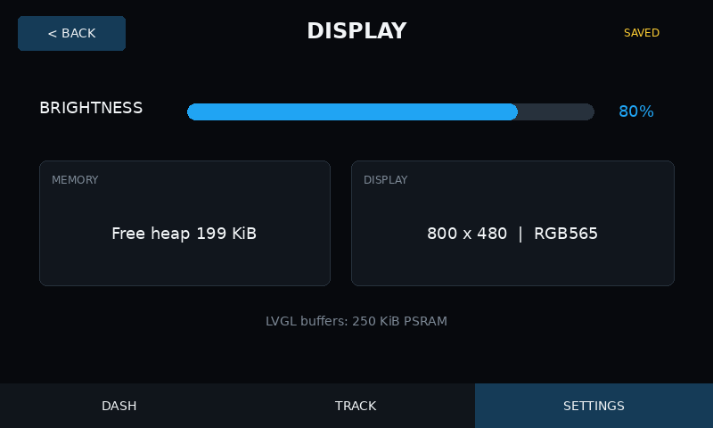
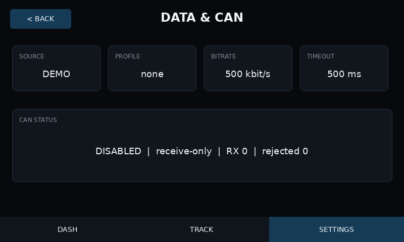
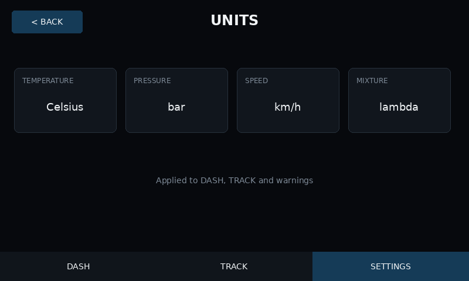
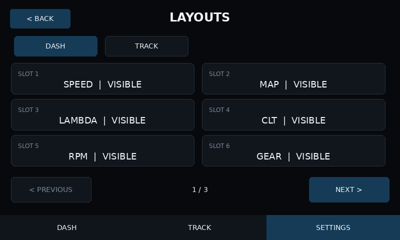
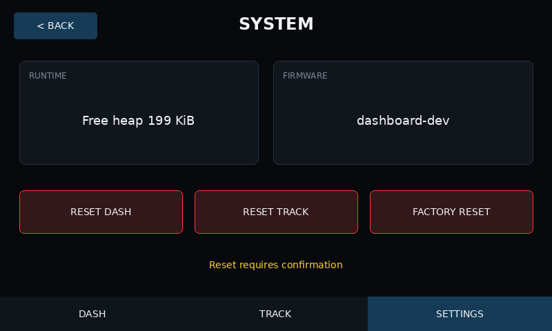
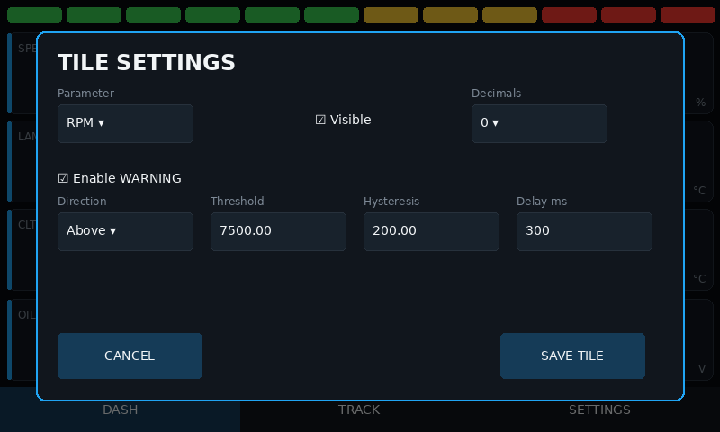
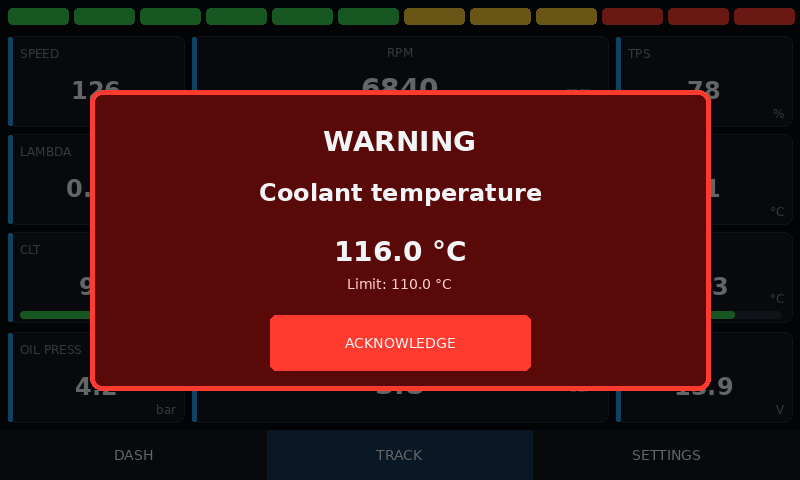
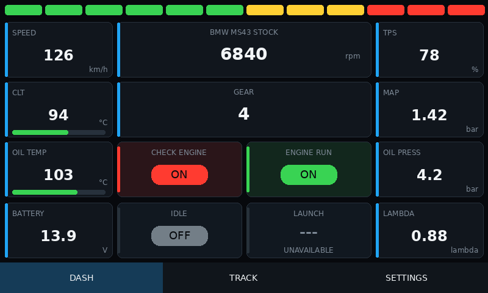
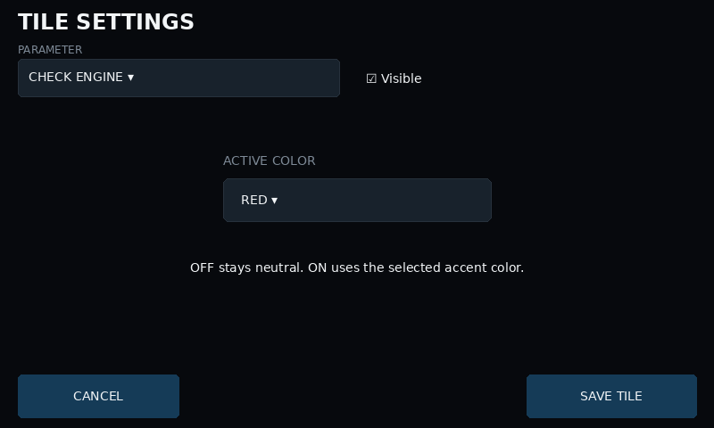

# Dashboard configuration guide

This firmware targets the Waveshare ESP32-S3-Touch-LCD-5 non-B at 800x480.
The bottom navigation contains DASH, TRACK, and SETTINGS; DIAG is not present.

## Tiles and layout

Hold a visible tile for about 600 ms to open its independent full-screen editor;
a short tap does nothing. Live tiles, layout work, warnings, and shift-light
rendering pause while this screen is open, but CAN reception continues. SAVE
TILE queues a candidate without changing the active configuration. The
application loop writes it outside the LVGL callback; only a successful write
updates runtime and closes the editor. CANCEL leaves the configuration
unchanged. A failed write reports `SAVE ERROR`, keeps the editor open, and can
be retried.

DEMO lists all 101 registered parameters. CAN derives the list from the active
profile's compiled frame definitions. If a saved tile is not supported by the
new profile, its assignment and position remain intact and the tile displays
`---` / `UNAVAILABLE`; the editor keeps that value as its first labelled option.
Filtered dropdown indexes are mapped explicitly to stable parameter IDs.

Boolean flag tiles replace numeric controls with an ACTIVE COLOR selector.
OFF is neutral with a grey pill. ON uses a yellow, green, or red rail, subtle
background tint, and matching pill. The color is stored per tile. Invalid or
stale flags clear the active styling and show `UNAVAILABLE`. Flag states do not
open the numeric WARNING modal.

For a temperature parameter, the same editor can enable a continuous bar and
set its native MIN, READY, and MAX values. The bar is empty when data is
invalid, blue below READY, green in the normal range, yellow in the final
quarter before MAX, and red at or above MAX. Coolant and oil temperature use
40.0 / 75.0 / 130.0 degrees Celsius by default. Other temperature channels
have safe parameter-specific defaults but start with the bar disabled.

Hidden tiles can be reopened from the paged DASH and TRACK slot lists in the
LAYOUTS category. Each page contains no more than six slots. Hiding a tile
compacts only its own logical group toward the bottom:
left, center-wide, center-small, or right on DASH; left, center-wide, or right
on TRACK. Wide tile labels and values are centered.

## Warnings

Each tile independently supports above/below direction, native threshold,
hysteresis, and delay. Threshold and hysteresis are configured from 0.0 to
999.0 with one decimal place and a 0.1 step. A breached warning produces a large red WARNING modal
with the current value and configured limit. Acknowledging removes the modal,
but the related visible tile stays red until the value returns through the safe
hysteresis boundary. A hidden tile can still raise its warning. Invalid data
does not raise a warning.

## Settings categories

SETTINGS opens a fixed six-button home screen. DISPLAY, DATA & CAN, SHIFT
LIGHT, UNITS, LAYOUTS, and SYSTEM each open as a separate 800x480 screen. The
firmware creates only the active settings screen, so there is no long scrolling
list to lay out or redraw.

Controls change the working configuration in RAM without writing flash. A dirty
category queues one complete configuration snapshot when the user presses BACK,
DASH, TRACK, or otherwise leaves that category. Repeated edits are coalesced,
and an unchanged category performs no write. `SAVING`, `SAVED`, and `SAVE ERROR`
provide non-modal status; a failed write keeps the RAM values and can be retried
by leaving again.

## Available settings

- Brightness uses a software overlay from 20 to 100 percent; there is no off
  switch.
- Source is explicitly CAN or DEMO. CAN never automatically falls back to DEMO.
- CAN is receive-only. Available bitrates are 125, 250, 500, and 1000 kbit/s;
  timeout is adjustable from 100 to 5000 ms.
- The profile picker offers `none`, six source-pinned ECU profiles including
  BMW MS43 Stock, and separately marked experimental Link and PSA C2 profiles.
  MS43 uses only stock receive-only CAN; OLM/custom `0x33C` is absent. Selecting `none`
  is the safe no-decoder state. A parameter not supplied by the active profile
  displays `---`.
- START, RED, FLASH, and MAX RPM use four sliders shared by DASH and TRACK and
  must satisfy `start < red < flash <= maximum`. Values snap to 100 RPM steps,
  span 0-10000 RPM, and changing one threshold automatically moves dependent
  thresholds. Existing stored values above 10000 RPM are normalized without
  discarding unrelated settings.
- FLASH ENABLED controls whether the complete strip alternates red/off at about
  4 Hz once valid RPM reaches FLASH RPM. Disabling it keeps normal progressive
  behavior through MAX RPM. The 12 physical segments always use four green,
  four yellow, and four red positions.
- Temperature, pressure, speed, and mixture units affect presentation only.
  Stored telemetry and warning comparisons remain in native units.
- RESET DASH and RESET TRACK restore only the selected tile layout. FACTORY
  RESET clears only the `diy_dash` application namespace and restores all
  defaults. Every reset requires explicit confirmation.

## Build and hardware validation

GitHub Actions runs native tests, compiles the exact Waveshare target, produces
a merged full-flash BIN and component binaries, and renders deterministic UI
review images. Those checks prove compilation and packaging, not electrical,
touch, CAN-bus, thermal, or long-duration behavior. Complete the physical
acceptance checklist in the README after flashing a test board.

## Screen gallery

| DISPLAY | DATA & CAN | UNITS |
| --- | --- | --- |
|  |  |  |

| LAYOUTS | SYSTEM |
| --- | --- |
|  |  |

| Tile editor | Warning modal |
| --- | --- |
|  |  |

| Flag tile states | Flag editor |
| --- | --- |
|  |  |
